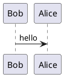

layout: post
title: Plantuml介绍以及在Hexo中的相关插件
published: true
comments: true
sharing: true
footer: true
categories: [效率]
tags: [hexo, plantuml]
date: 2017-04-14 16:31:48
keywords: hexo plantuml plugin hexo-tag-plantuml
---

![plantuml logo](data:image/png;base64,iVBORw0KGgoAAAANSUhEUgAAAa4AAAB1CAMAAAAhpfXwAAACkVBMVEX////m5ubp6enZ2dns7Oz39/cAdL2GESz7+/vh4eHKytScnJyxsbnc3NzBwcPk5OTx8fHU1NSzs7PqvQDGxsa6urrNzdHFxcu+vsXn7O5HFGP6vYzKysqsrKyUlJQ8h+QAb742fd33snry7Ofty7MxdtgogeQtcdX/ewCLi4vxgwAWV8XruJ6AABcgXccoatDzwwDk29ZTec3nwKveWwDAmgDlxrZiAFAuAFLe5+zj083sv6Twso35pUZGCmTo2tJ7AAD5oj7/egDzvpb4q1zbdET85+fwpncAS4f5sm7csQDxgQCIACR+ABDx03br0sTZfVT34Mz57Mh2dnbzmJjk0dUAU4b3mlz74eH0pqZRWmMoXaXeqZUAICEuaLgADCkAAAA9QxJ1pbjbhmXcl30APXOqeWY2IQA3UXtvlbdRWnvhbSCAbRA7MQ3bbC/hVQD8nlETPVzniE92UguofzvnbQpdQhmSbTOHf4jxqHw4Y57viEA1SVwAOWVlBiAyDEEaI4MJJ2FaLFG7I5fdALLuZLJnBjtNMjlkVFdtOCdZLTDzkxOmGonvALuyz7dKR1dRR5MXH0gsSUu7GE6QLSB/JjAzQTDBLI6+2KJ0Zr47a46JADpiBBmkLn24lYKLeDOdebEqGjR0Xy55PUY+LVX446O7jZVWRWfYZJAARsG+ORW9f1ZwIAgmBB/ckVFwMQCPSACZSBhhP3c5LTvzzle1U2CUUG+DXH9falOSYFP23I3BTQC8cB/EoIDqMjPwgIDrQ0T3wcHnAACiklxXICtgTE9blGsRPiWCy5e1qjWihhhYUQp3CWBPG0VDVDS0Vpqvv1/dY3Wvd4DNmi3Jpquqm7QPZjhWL2/FbBxZJj/Ss3OvCR/gAAAWtklEQVR4nO2dj5/b5H3H9cNOLC6yJJ8N6CJfkovD/UD5IXxR7mxziu9yMYmvKNwlc0g81u0OujbsLiRL12sobNAFiunCfoR1BUr52bF2pCOBUChQKG02NlgHdKz7a/Y8jyRbsn5YtnWO93r5wwvHvtM9+uj7fh49P/SVjGE9/f9WxE3X2lhP9YqEaE6Iu4gjesS6SREmHicJ1k2JGNPj1T1ihXg4whJuCiW4GNXj1S1io1SEwN1FJLger65RRKDCHrA0XJ3itb8TO2lZ3eCOiUc8aQFcZMd4vd+BfbSuLnAXibOhRrhorlO8Dq/9LtpQF7hjow0aF8RFdojX0S4IiLv2v3etHWAYLnj0XIyEcFEd4hV+F8O2ru0u2lDk3S7ovSiO9WhYSzzExdAd4RX+YP/RO9dyB20p8i5wd83HxzTt0XXxJxEunOoIrw/2v9/FJ8N3j77fBSdD0hNXnoK4CKYTvA4fxt5ds8Lb1p3vdYU7T1yZPOq7QngneL139Ogv1qrs9nX4/f3djovP7QMnQzzBhogqsBizVk5Av/XB0bUqvG1Bd10w7yJJV1xEZmwG9V2cABSPR6MJoFh4rawcxg53Qe/gpsPYnb+41h68cBH42VvRG4pEopFC0dCaeTm6v4uHGtjRcBdUJldcBLWcV3nbj8NriAvr3nMh1NFrPox3x8VnTuTRqZDHpY7h6qmRXHDx8pn8xkkAK7NUZiiT2ATRNVkBrukK19wZ1Jq4c8bFLxXzM5MELy8fAoOLpEmJ0RgYc0DFBTroUUcTBxIJUeZ0hahZcQFfC2DNlBnGLckUVntk63FzxMUvVvIpnpdm3/4Bh7NhJHtSAJkUguUVW4j63DKCo3QFF2PheIwOnldiIeF3U5ZLcIybO5ZIRtlWTTjh4mfzYJTBy2//GMfAnMstKYATEoHy6hvtGx30tWVYiLMRFl0Cd3QW5WJk0LySwN2ory0jeIKOhEOu9qhEvGVeDrhA26qoPCG//Q7msfyLE4LABclrdLAPaMHHgYTjZMTrIh1KVwiY16Dmzs84i0qEveKGkwku2iovkqs/cEIdg2NC5sQ7mFcKB8IVIK++JIwHeG24ZYTjvK/RaekKgfKK9WnufLSvUMKzLiFcXDTRGi87Lj6Xr4BDTv+8wV4RruB4Jb+5AKtvonEHQSQwT2NGukKQvGLrkLtYY3eReMizbQFcUbJlXqTtehe/sQKXCt+RvTNuAC6ODJBXcvO6Y7EFDos12jAi4A3ioV//DpJXDLkTGrvDQg0vzyNcLfKyty48BXEx72xtlMMhcHSAvACudfeDrqFhQMIJP+kKAfMCuNbdR/lwh5F0g8qEk3EUt3grvOytC+dPjuE4nfQKimTgCo4XxPV7mI+AhOKo2bumserpCsHyivl1F4mznj0+wkWRrfJywIUrY2WejHng4nMIF0kFyMs3LlyAjqnr3UTq6QqB8vKPK9qgD0G46FZ5OeHisyMMmfDYLT8jExAXEyAv37gY5Jjc4KYbCD1dIUhevnE1PlXjpMC0zMsJFxhtnKK9cWV5gIvGqeB4NYmL4txEVtMVAuQFcd3mx50vXNW4Nc3LERfOr5Y9cZ1MIVwgKk3yqs6qbBOYJnF5qZqu0CyvZNVd/d8Ei4uAvFoab9D1B0/wsKvkyzF3XESmosC+izIlBfjjtXBhAf0befPgQt2vAsVlSVfwvX5ouMMWDr5Z96tAcXHInVbR49GmzktWXDyvlMsyKtMDF38KTswIIY5yAvSkgCTecF+RX62fWw8jwj+/q7+/ykvzGyguzuLMZwV+VHcXfr6/v7/KS3MXJC46YXHH+XOnyYyLl5ZOLKqodXnh4pcqKW2/JuEk2WhXocfm1q9fP7eATT4LaFV5LZxH4QwQF86YnYWExhUJiH3E6k7nNXopZLgLCpclbhQRb6ZzNeHiyyvFEmhgSO5DDUBraNL2U5ZuVEvID2E8YER+ieKh8QqfHxi4xGLB4rIo7AsXZbh71Owu8ihwF8ICxmUWwUZbxIWrQ5WRlfHxWaDlt+9x3i3BL1b2wTfgvGn+eagRrvjTWjyAntcDcnAUo1+cGtB49V1TXMIDNneAF3MJunsu1E24TGtN/CSuqKlUKptKyUnH1sVLy/l96N+lJUsORyNcyafXV/VUldfCj2A8EC//uITgccVqdanmrt9w9xzRCi7S7dZ87f78AHBBDhkGngsJ576LV89AWry0eKIuS6oBrtHtRjQuzJl56QEZuBT2fzJEuGjSh/ziGnRxd15391yo+aEGFQttDZmucFvFxqggcPGLJ7S+yxEXnz6TH+IJfunMRr5uZay+71Isn5IvGLV37vNPQWye0rrz+ZcOvmjwGnXFZS1Kw0Vc77qqUdONjri22gaKiZq7l1/eXuVV784Zl2KNdg1Xkh2+8sYLL7xw7ArQwpv3/Oxnr79+i67hcDIQXMzIyPihpaVyufwDOy6+jBJumOWxlG2sUY+rIps/bbj/gh6P9XuPoBqMeF2evx1GZAoG5Z/XuQVk46uWj1rrIl3XDE3ScMWtuO6o1M90EmZ3r1fb1+X5t3y4m7G6CxtDNCoZfuXc9r0/uXhuz549//H4d37603/5p3+8Wdcr4SSt4wq1dTLEZ0rFkenp6TM/tnWZhFxEyWzLlZQ9XZQlrbhuLZp5JTffj+Kx/QiIyX546gG85g/2vzR/+eCDU9e9hsYbbq1rplgwf9T7LtcVecvivBOu4tk6XjGTu+3757T+a/5y/0svwdp0o+HOGVe2aOFlxjVwYe/FiwjXM49/9NHPP1v+9Ikdml6JBIULnAhxRVEy9qEGfyJ/Kw/H8Qfs43gHXGZeoGO6T+sbjuyde+NzxOve+XkQjvlduye+YCcGBqZARFzqb9HCq+mhRj2usXpeCcPdeuDu9SNabYLuLs/3H3xwgJ3ycpcqWniZcZ27+JOLF0//DjSuZx765KPdnw1d+K/gcWUYWDHtfReRqaBmVXRqXDquSMrQrcUxEy907RGdbj79fO/eI1+Cb8/dO395fr6/H/C6ct3E1JXXBs5/3xwQ1ShqaGzMzKtFXHcYxc1UxsbyFl6JmrsjwB0adzxlckdNTL12ZeCSq7sxEy8zrr2nv376NML1+JNXP9l1+X//572dGq6bW8Yl1I0Ml1bSGYrgaftQQ6nApULwOuOKKzy0EWjowL5bbwVHUUyZca27BE8zX/r880/3I1xzv9s933876CN2/XLit7+9Qnwx9cWXzQHZWC0KxHdsqF1cWVTegX37UHEWXhCXxgu4e2Or5u4Nw92z0F3oi6kBi7sZi7saLzOuD09fPf31q89BXI8/+d+/eeujz97bESguAudz09PjYK7sME3m8xAXU8kXHYJSh2sfxDU2ZvBCuNZdQhF5+YjWrX/Yd/AyisdHgwMTJGhfUz9ibLhQRGBAarxaxJWqFpcvQl6m8WHC4g4NO+Ye6Nt9+S3krm9g4joSuHuRtuGquXvViLkZ1xP/fumxq1cfQrge/vW//vrfLr+8YydSALgInpfkDM4rq2enR0am7UMNfmYsDXierFSW3IYaGq6NB4yjMAZhGi4tInPbNVr05O5+VHsnOTD8mhiY0tYOHXDlYVFFYzzfPi5Uk7L1uCzuHuBYzd29k9QEHBxOaWuHDrgQ/aLqgOvmTz7ec/XjPRquH/7nwm/eumVnULj4zNJyWYUrFWCwoahOqxr8ybNgqJEayxdlWz6CBZdR6SpGFqWOa90jxnR07rEQRqOAPM9iAhx6TT2qbeoUEBjeakfYLi6t4c+YYqDj0nhpdYnBeOhu1/M8Rk5Ad+cjXu5qp30zrh13fbwH0Xrm8Ycffvi7g9/76o72cWmRJxZXSnA1Qz9G51UNaSwNeA1VKmdtzUvHdWAICp7S8yZaVVwGr7lfgWYHcaELSxDXlHE9pda6qkWB+JqGLRouim4syowrWyuuMlbMmWOQqHf3CGjnCNebIJQQ19Qxb3dVWmZckR3DTwBYA3/9N+cBrm9/96827BjWtaNNXIQ8PTI9C1oXb6zIO65qKGco1IeNueDCtupi9wFctQzlKq51j6F4oJZE7951EF1UFqamJqpXl6sBqRY1k6+YJwVNr2pouMJGeal83kqrhkvjpbnjgTtUhUC/NVG9NmdztxW6S9fKsuIa/s6ecw88+Od/8RDA9ZepW4aruDADV6hJXHGdhJornZ1eWVkZPzF76NChxcV7HNcMlVOgeWXHDrjhqmpfvkLUPsWOr6vympub046ePrhbywUQpiaStU1tFkFAzFNurXVxN/iQGVdVd+QrVlpYvObuEXTJC4rfrdUlgGuilgjuMO/KV0y0LLh2Dg9//9xTTz29/sMnn/n2nUM/rNIa3hlpExccafA8o6jZbG4Vqn4RSksKIDJpgk8VtWsnBMHwBjeWq8dFmD8ubK7xuqAfPfXsBu2N8KLpRiEHXNYFrbZXNSozWJ1GTbwu6DfB8IY78kWTJQdcFlpWXNu2bTv+d6cv/O2HT/79927/h+FtVQFcVIu4GBMTJl2WMxJck5+0nAwByHQ5jZJBGZwvaavxhLy0uLLIOON6te7hTseqvG4zWhJlQBIE04YOuCy02l/VqGtbULXadNy4ZSlkpMNz5pvOHNxZaNlwbdvy+39475987Y++unPbNkdcRBu4AA25vLS4eGh21nQyJIjy7HIa14chhKrwBBqVgFeleIJwxGXzcL8RkeNC/a8ssgekrqh2cTlGp1qbNsfbc2fGNbwF6viX/+CubVu2bTFruGVcUcp6dARRP9QgMuMjYxm+KoLKAKaHRMiZ3ziiDerrcdkP677NFlxh1mYzzDoGpE7t4nLW/QauhLu7iK/rXfW4vvm1uzZt2rJljXDpMg/kmZmTY+Mr48swKWB8fHxl5cyp1TSDToj8zEiW94ULY7+l49Lqb2LUlouTHA2Zcv3c1Cwu1heu8H0WXPFR2+HERnEf7sy4UIu66/SffuOmLYHhStANccGJs6Roi5qqqmzlaxM0/uyIlgPQGBdG3W0+3UQH7bgGrx0ubOu3zLiEQTuuwaZxbdq06aZjX/+zb9y0qaot6P9t7eAi9BxKs4S6VQ0e106H+keDVnlaX+/1gQvj7g4EV3xNcGHS3UHjQpT++CtfWbepXjeFW8dFx2F6YtSqWJ8FFyGvKLXei5dkPdfXoOULF5a4LThcjA81hQuLI3da79QGLtaKa5MdlgUX3hyuWHLDdQ660YqLL4yMzy6irIClxVnQkZ1Qwazr0CnFbd7lrL7jVVxG38VSDKU/dc9n3xVvblXDNy4sdlsVl9F3mdz57btquLbd5KbhVnFRoy7HOlh3MkwNnYVJAUAjxZOrWYUA0y6ptrjhDxeckOqnGxbXVuuF0cHBUe1tCD69xGfruv5GH2oSFzZ43MBluOOgO7YJdyZcHs9NiWCx1nCFtBvubQIhrOsD0KIHEGP0YYR5JconLjAh3Wy9HduEC8nvydD3qkYTuKA761Ad4TI9ncE/LiaedFMUdD0C0xIuLOx8pGSs/s4UKcPrASB4h+tdPnFhx4573z0f/FAj6h8Xduwu75mVf1y45VFahph6d83ichGbsAaFUFcWteUpXJLLZbweWMgvLuyY95OEri0u7FhguPxpTXCBZqWMTI/DrAD4//T0SrnuAqV/XCw4v3io4ZMr1hZX2Nudj1WNJnExQeMCfZYsg5mWWBqZHgGaLpZmlLoJGB4SmrpPqQ0x8QZPkGgLV7tqGhcVEC4jKYApLy/KelIAo6iqgptmyxmV6Hpcic7ias4dQQeKi0+vTIdqSQF47Q1cCpZOVXHFuxVXqLtxkQHh0jjwoKMaX5IzBG8Vk5HLi8tg5sVn0HZUtGO4oo2eM2IVFessrubc4VxAuIzysoWTIyswK2D5kKbZWbgqf2JRhKuI8qy2xEt3EFdz8SA73Lqac0cFjUtbJFRTWTGXy62ugpdsSkWr8lJ6ceUQo9UmsnMnQ4jL/yIU02FcMcY2t/ISHRQu814JtSyrkp4mhUsZOQ3OhCvjh0RGH3QwZLzhreQBiUHOfC9CUWSCaFxoYArH7FNhL5FcU7eSu4lNWHZLEJk0zAqYRVpcXBLTqmmEiNNklApgr37EJCjNkb81KJJu8UmPralJXDQZzIiajdF1u60bbBDmLpUCQenU8+V1XL7jQSfW7GtAHBS2xc1LDEkHU83tuNxFUBxJdiwojMv1b0dn8EKr0MnHygNc/msTwwXV9n3jAq2MA7Q6NtLwj4sgGAHGo5MjDYCL9ImLIEiBDKjrArhIRksKaHB3PRdNAFpkrGMdBFNNV2hgTEhEkb+OfmcDxAX7icZxiycEcKaOBTMOArgowSEpwKY4gMWRsU4NNBAux3QFm2DdJblYZ7+zBeLi/MctygVTmdhYbMONTlkBjgr+KfvuYmLJDTf4NXZDR5c0MDhNTjQRtw1BPSc83OdjHmqoQ18xr4kY9G8smSA6/PU1kVgTgUu28W0odbuNOicF2JRMJshOTmxAu/ftLE51cgyviXPJprDbS3D2VOGWFXb98hOrQgHuM1BnITZ8Lb4YKsL6jVvnq1JPPfXUU0899dRTTz311DWK+MwO8TtxiISbUuPZUqAFBu6uyRLbnRzigs9LAIKv7z8Ic0KDxek6CZx3PQi0wMDdRXCBa6pATmhroSwsECEeTrsJ/cW8iBCC6YUh/achwc/3enIkC/8Eiof/wRf43vihXaRnRMIcFzKK015sxWs/430UWCusqpqvWmn+3UVCcaK+QKsZm4h4qA1eLIerM7yiqpKES6rEMOCNQlHgRVEYFWdKq6osSYzKMDjXGFeE5ahULi1KCq5IOSXLZ0v8WUnGcVHM8SojqbwiSeDfLCgcflAkRqI8A8JyxuVJUVWYVJZXc1kR/WlWBcWvSiUmC9PtZJE3nsZNudarWmGGlFVRKy0tg9JySkHKWjdwLwwqjAtGQQo8LoXhtWNWVBxnFDGlKDwMKDhOVdKfxN/Wt3KD+Mq5SVUVC1k1nS1NSqVMTpRVMafmpEJBpXKiKpdK2VWKovzhotO5bFYuKas5URInRbFQkGSGESflbGE1p4qlkiiLOTFbKOTAv1IuK9GNcOk334iSXFDTjAr+WC1lCjkxA4rPrhYocZLJZeC7tLYl7Wq0WlhVmdWZrFpQC7msCkvLFYBnywbuhUGFcU7bbBL4gcelToJicoWcCuo3OMBsqqSmV3OZbEkFh6/dVMS1hQs+rCyTSRcKdJEqlWgym8vlMrmCSK+CwEi0mJblQjpTyNC0j6X4CEvSIj0JGKlpUQQNIStmxUxOpnLpgpqTwefVNDye1TQ4FkpclTMFyrtclia1B6qpWVkEligZRGQV/LWYTovpnJjOkgWZEmnQfMWM/uw11wKrhVWVkYEbcDpIp7OoNHCkaesWnu7CuFagJAFcNChJpVaz4MjBoYNjzoLKWlLFVXGyVJIzoqgX2BYuBt6mLSoUvBkbvkg4Q+ESg95J+k3aFPwpzvjBZb4ZDZzpGHi3LziZUgooDzQQ/a41eA5ESsvgJ564TMXBP9T/XiteqRavfTY2dcXldM+cVnDNrFL3a29cxlY5+CIXJKp6zFq5FJPL1RXYzlgjQsC+kmXd+8ZqH+lnKB+Gj6lqRnzIe4oQJpos0MtooIWh6LFM9Thqr7ZDtMhHrffaY9incX9XuiI+L5zV1KBcv1eUTONZj5u6gyxMi17TBV6T63I99dRTTz311FNPPfXUU0899dRTTz311FNPPfXUU0899dRTT076Py+r3xYiltaGAAAAAElFTkSuQmCC)

## PlantUML 简介

[PlantUML](http://plantuml.com/)是一个画图脚本语言，官方介绍如下：

> Generate UML diagram from textual description
<!-- more -->
用它可以快速地画出：

1. [Sequence diagram](http://plantuml.com/sequence-diagram)
1. [Use case diagram](http://plantuml.com/use-case-diagram)
1. [Class diagram](http://plantuml.com/class-diagram)
1. [Activity diagram](http://plantuml.com/activity-diagram-beta)
1. [Component diagram](http://plantuml.com/component-diagram)
1. [State diagram](http://plantuml.com/state-diagram)
1. [Object diagram](http://plantuml.com/object-diagram)
1. [Deployment diagram](http://plantuml.com/deployment-diagram)
1. [Timing diagram](http://plantuml.com/timing-diagram)


对于工程师们来说，用代码的方式来画图，简直是为其量身定做的。PlantUML语法也非常简单，参见[PlantUML Language Reference Guide](http://plantuml.com/PlantUML_Language_Reference_Guide.pdf)，它支持很多[工具](http://plantuml.com/running.html)，可以生成PNG、SVG、LaTeX和二进制图片。

## 工具

有非常多的工具来协助工程师们使用PlantUML的语法来进行画图，比如ATOM有[language-plantuml](https://atom.io/packages/language-plantuml)、[plantuml-viewer](https://atom.io/packages/plantuml-viewer)、[markdown-preview-enhanced](https://atom.io/packages/markdown-preview-enhanced)等各种Packages。当然其他的编辑器也有同样的类似的插件。

另外，我也写了一个[plantuml-tour](https://github.com/tonydeng/plantuml-tour)的项目，其中有哦PlantUML的一些例子，执行脚本，以及安装说明等。大家有兴趣，也可以去看看这个项目。

## 例子

下面的例子是通过[在线示例工具](http://www.plantuml.com/plantuml/uml/SyfFKj2rKt3CoKnELR1Io4ZDoSa70000)生成的。
### 比如这样简单的三行文本，就能生成一个基本的时序图。




[http://www.planttext.com/planttext](http://www.planttext.com/planttext)也是一个类似的导出工具，并且可以在这个网站上直接查看和测试`Plantuml`不同图形的语法。

### 除了之前说过的可以生成的图形，还能生成其他图形，比如生成🌍图形。

![xearth diagram](https://www.planttext.com/plantuml/img/RLVRSjis47tNLs2ObtGcml0caNfgV4aQtnBNafjftrOIBAAY01KauoXVtxEWRCcayg8Cl0livUmvouzLJQvkDkNWfy9_Ye4OHpBAn30QXJ8CHN1c5eLrj5A1EFnx9yvAgjRqGJnEpmOYoTbKY3YHMGANkb2cEhRtBdyufHOArebC-IHD-JSufrMnf6NGiRvozDz0HFv64OMX78LiQrPhk-xQpWhI9Pabxfx8IGpxQ2nJH7AkzB_QhBhs5uKsD12ZM8vmEJ-IncpiIctwOIkt8RF3tR5aw-4ubPdmvfjcITsxzyS3aS8SziCiac4ESrlLjd_x7LKLBOgcKdLTjUL4wMNE3wMPdF13ZYfTwhSluI57ltGvW9cC-GHUIMlzwnVzq6Lvr36aRCtA3eP9AiS8VZZAstesojXAd6cd3lr2SzrAcThNA47q8npYDnw9u8AqivqauF1fjTlM0n6Ze7oGvpwK2oeNJLrt0xyoIqq89P4JN_rSfXaRRvMOsMVp5cTJszI5E7joUa4UEcC-7sRy2v-AvcZyulW9rDGwkrXOyVw1vbJ__Xjw4ScSUv5dCkCi2josiZt8bUY_rTKBgcEPeG_3oLZcgDKbbS1yhu4pzPDUFE9SZZcbB9CnFBwgPt6foaA_JQdDdw6AM8PHEF9pTgdC3-Lwrr_O4jEtj2yleDdymcWaOu3gifcJxhVZyUoJU7ysRyHbGNED0WpZJ4Q27vlucVj4LQsSkAfuQe9NlpV7m276cXkKvUmSVCOiTT-24n_xGUNMHnXgr2puew7D2Li-1iE4Ck8auZRpBwgij5dhe7klQMSQg6A0Hr7gm_W298iR-tQgtudNOpX4CecPmJBkEZlOiYcRplrVw9cqtjTrj7yZJ3rohzowgQiUp-oFFuY7fgguXy0LLqZ44_uDha2cPjwKdPTcZLkh7JfYrkI8yJWS-mf4uTZZyPhmXxf79G2ADSe_XF7B-J0PSPp1jN9DHQNQT91LELAW14ovdyFnn5lVK3ScRttsj2h8Q8uPDSkOr32wBOlSK5s0zPRDsmU-gYtXVaY3P_0av7U26wr-d6ZsuzgHDY1yaUopZMI6VjyqL9AuRJRRnXsHpXrETpvP0VBsyIUU6MungjsvurZqIZacaYYMKSYSa35L1RTwGoUYkKV947d4l0VZa4KkkBLSujxGFHfTgwMuWNGiBG2RXYmGy88QGIZkQEdqikSrtI9TJ4BgEIgAFJPWRA1DVTeebBWlmD9wYnfL7hHjpXC_G7TgiUYbWJUeMMhmCyOQXOhyD8EX9duoxjHF3TgxqFNkcFhRum6FMyxMUUXHSQTfSu8xFeDlzF95sT4AdtWKjb5Pu-oFdXJTwhblXKX7FebXvjc0pMkdg3iFVpPghXOVn0KPOgK4cMLUOpAFZpjRBUnphs8lCpUCcFfWFVRJ_PKLQQwxitEZp8wldkn59lI3zgqgU-h5KBBkcQ3mQIvpFmLUkeDxSle4y3uxA8w2WCKjFK9uMQO1iBeuCMLDLJig3zK1NhrC1lVMrSVyktVuvjJAcdtzXs5RVr0mk_pPwFgK_2uQI8G3iu8Y-Gc0QG9uFwZT-b_i0kiEJInKI_089CzvqKYycZneAvPAN9DH1vK_B1eiebnup1ll3WzseqxKyggc4gMCMcRq3ET9cvSkSQTDSS3dE_6NLhMXZNZ_XI2yp8n9rgeYGWC715CoRRqrC74GAcmM-iawerznYZvp9dagmwnrkxQLwfJs0ZiOYGU_IaHv2zNnsC-EzsZ8T3pk6tJLielr6qkBxj3d19TQTzS8lroMJ7hHNb4IZuufk8IsrdNMwDTZlo_oQiPBT8BoJksJFa40vqsv8ZzhW7QotvzulvpMTh4kRDcHXEcpMYhJRbky68_yTXzCTqkZThqPEu1r6FaLQnYb4u-y6HMwxj85QCmVevhZLf_0a25RwysyMTTToGN5Q_7-d3QqjhxP8vzorAv2mSokToVGVKrRLYY05Eo0wa_yjZx3acUwmu3fCVYUqVP0BfZI2Vy92mgptipfhIrxT046OxfeDswFMcxQ8yP4d5DjZ_SotY-nIxSJ3O7bJGCzWmG5Vm6ejkciSUYPl927W40oiKV6M2Re14R0cBu--4vuvSzzI5xT4D9tgl3nidhxAV6gMDEQQeZ9C6qvCifINc63xuetsvuJxwV_W9xzbZMEMtAAsWteRxZOvxNHJsy-8xxAsL4gax3zxXFjfo9e5BlwlJt-ycZPTNyy67Oysks-vt4u7dnKM48svVy0)

下面是生成上面地图的plantuml描述

```plantuml
@startuml
xearth
 61.17 -150.00 "Anchorage"           # Alaska, USA
 38.00   23.73 "Athens"              # Greece
 33.4    44.4  "Baghdad"             # Iraq
 13.73  100.50 "Bangkok"             # Thailand
 39.92  116.43 "Beijing"             # China
 52.53   13.42 "Berlin"              # Germany
 32.3   -64.7  "Bermuda"             # Bermuda
 42.33  -71.08 "Boston"              # Massachusetts, USA
-15.8   -47.9  "Brasilia"            # Brazil
 -4.2    15.3  "Brazzaville"         # Congo
-34.67  -58.50 "Buenos Aires"        # Argentina
 31.05   31.25 "Cairo"               # Egypt
 22.5    88.3  "Calcutta"            # India
-33.93   18.47 "Cape Town"           # South Africa
 33.6    -7.6  "Casablanca"          # Morocco (Rabat?)
 41.83  -87.75 "Chicago"             # Illinois, USA
 32.78  -96.80 "Dallas"              # Texas, USA
 28.63   77.20 "New Delhi"           # India
 39.75 -105.00 "Denver"              # Colorado, USA
 24.23   55.28 "Dubai"               # UAE (Abu Dhabi?)
-27.1  -109.4  "Easter Island"       # Easter Island
-18.0   178.1  "Fiji"                # Fiji
 13.5   144.8  "Guam"                # Guam
 60.13   25.00 "Helsinki"            # Finland
 22.2   114.1  "Hong Kong"           # Hong Kong
 21.32 -157.83 "Honolulu"            # Hawaii, USA
 52.2   104.3  "Irkutsk"             # Irkutsk, Russia
 41.0    29.0  "Istanbul"            # Turkey (Ankara?)
 -6.13  106.75 "Jakarta"             # Indonesia
 31.8    35.2  "Jerusalem"           # Israel
 34.5    69.2  "Kabul"               # Afghanistan
 27.7    85.3  "Kathmandu"           # Nepal
 50.4    30.5  "Kiev"                # Ukraine
  3.13  101.70 "Kuala Lumpur"        # Malaysia
  6.45    3.47 "Lagos"               # Nigeria
-12.10  -77.05 "Lima"                # Peru
 51.50   -0.17 "London"              # United Kingdom
 40.42   -3.72 "Madrid"              # Spain
 14.6   121.0  "Manila"              # The Phillipines
 21.5    39.8  "Mecca"               # Saudi Arabia
 19.4   -99.1  "Mexico City"         # Mexico
 25.8   -80.2  "Miami"               # Florida, USA
  6.2   -10.8  "Monrovia"            # Liberia
 45.5   -73.5  "Montreal"            # Quebec, Canada
 55.75   37.70 "Moscow"              # Russia
 -1.28   36.83 "Nairobi"             # Kenya
 59.93   10.75 "Oslo"                # Norway
 48.87    2.33 "Paris"               # France
-32.0   115.9  "Perth"               # Australia
 45.5  -122.5  "Portland"            # Oregon, USA
 -0.2   -78.5  "Quito"               # Ecuador
 64.15  -21.97 "Reykjavik"           # Iceland
-22.88  -43.28 "Rio de Janeiro"      # Brazil
 41.88   12.50 "Rome"                # Italy
 11.0   106.7  "Ho Chi Minh City"    # Vietnam (Hanoi?)
 37.75 -122.45 "San Francisco"       # California, USA
  9.98  -84.07 "San Jose"            # Costa Rica
 18.5   -66.1  "San Juan"            # Puerto Rico
-33.5   -70.7  "Santiago"            # Chile
  1.2   103.9  "Singapore"           # Singapore
 42.67   23.30 "Sofia"               # Bulgaria
 59.33   18.08 "Stockholm"           # Sweden
-33.92  151.17 "Sydney"              # Australia
-17.6  -149.5  "Tahiti"              # Tahiti
 16.8    -3.0  "Timbuktu"            # Mali (Bamako?)
 35.67  139.75 "Tokyo"               # Japan
 43.70  -79.42 "Toronto"             # Ontario, Canada
 32.9    13.2  "Tripoli"             # Libya
 47.9   106.9  "Ulan Bator"          # Mongolia
 49.22 -123.10 "Vancouver"           # B.C., Canada
 48.22   16.37 "Vienna"              # Austria
 38.9   -77.0  "Washington"          # United States
-41.28  174.78 "Wellington"          # New Zealand
 62.5  -114.3  "Yellowknife"         # N.T., Canada
 90.00    0.00 "North Pole"          # North Pole
-90.00    0.00 "South Pole"          # South Pole
@enduml
```


## PlantUML和Hexo整合

无意中，发现一个Hexo的插件，就是[hexo-tag-plantuml](https://github.com/oohcoder/hexo-tag-plantuml)，这个插件能够让Hexo生成的网站可以方便的集成PlantUML来生成相关的图。

使用起来也非常简单，只需要将原来的plantuml文件中的`@startuml`、`@enduml`分别改成``、``，既可以将原来一个个的plantuml文件中的图形，展示在网站上。

### 安装hexo-tag-plantuml

```
npm install hexo-tag-plantuml --save
```

### 比如我们通过hexo-tag-plantuml插件，在网站上展示相对复杂的类图


title 售票机控制程序

scale 1500 width
Component <|-- Keyboard : 继承关系
Component <|-- Screen
Component <|-- CardDriver
Component <|-- CashSlot
Component <|-- Printer
Keyboard <|-- ActionKeyboard
Keyboard <|-- TicketKindKeyboard
Keyboard <|-- DestinationKeyboard

ActionKeyboard <--* TicketSoldSystem : 组合关系
TicketKindKeyboard <--* TicketSoldSystem
DestinationKeyboard <--* TicketSoldSystem
Screen <--* TicketSoldSystem
CardDriver <--* TicketSoldSystem
CashSlot <--* TicketSoldSystem
Printer <--* TicketSoldSystem

skinparam classAttributeIconSize 0

note top of Component : 抽象部件类，所有部件类的父类
note left of Keyboard : 键盘抽象类
class Component {
 +init():void
  +doSelfTest():void
}
class Keyboard {
 +getSelectedKey():int
}

class Screen {
 +showText():void
}
class CardDriver {
 +getCredit():String
  +debitFare():double
   +ejectMCard():void
}
class CashSlot {
 +getCash():String
}
class Printer {
 +printTicket():void
  +ejectTicket():void
}
class ActionKeyboard {
 +getAction():int
}
class TicketKindKeyboard {
 +getTicketKind():String
}
class DestinationKeyboard {
 +getDestinationCode():String
}
class TicketSoldSystem {
 +verifyCredit():boolean
  +calculateFare():double
}

note as Comment
<color:royalBlue>(1) 目的地键盘用来输入行程目的地的代码（例如，200表示总站）。</color>
(2) 乘客可以通过车票键盘选择车票种类（单程票、多次往返票和座席种类）。
(3) 继续/取消键盘上的取消按钮用于取消购票过程，继续按钮允许乘客连续购买多张票。
(4) 显示屏显示所有的系统输出和用户提示信息。
(5) 插卡口接受MCard（现金卡），硬币口和纸币槽接受现金。
(6) 打印机用于输出车票。
(7) 所有部件均可实现自检并恢复到初始状态。
end note



最后，再安利一句，**plantuml**和**hexo-tag-plantuml**，你值得拥有。
